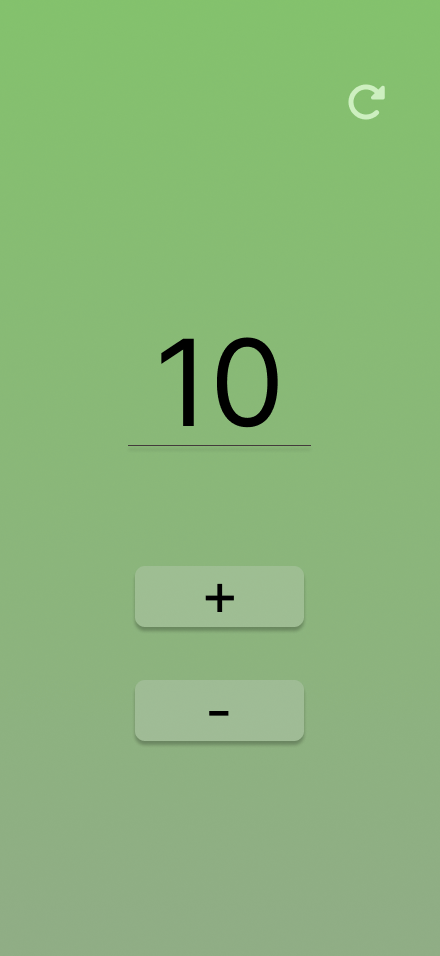

# Proyecto #1: Contador interactivo

Objetivo: Crear un contador simple con botones para incrementar, decrementar y reiniciar el valor.

## 📚 Descripción del Proyecto

Eventos en JavaScript:

Los eventos son acciones que ocurren en el navegador, como un clic, un movimiento del mouse, o una pulsación de teclado.
En este caso, usaremos el evento click para detectar cuando el usuario presiona los botones.
Manipulación del DOM:

El DOM (Document Object Model) permite acceder y modificar el contenido y los estilos de la página web usando JavaScript.
Utilizaremos métodos como getElementById para seleccionar elementos y innerText o textContent para modificar el contenido del contador.

## 🛠️ Pruebas

El botón Incrementar aumenta el valor.
El botón Decrementar reduce el valor.
El botón Reiniciar lo establece en 0.

## 🧠 Extras para mejorar:

Evitar que el contador tenga valores negativos si no es necesario.

Transiciones:

Agregar un efecto visual al cambiar el número.

Contador avanzado:

Permitir que el usuario establezca un incremento personalizado.

## 🎨 Diseño (Vista previa) 

